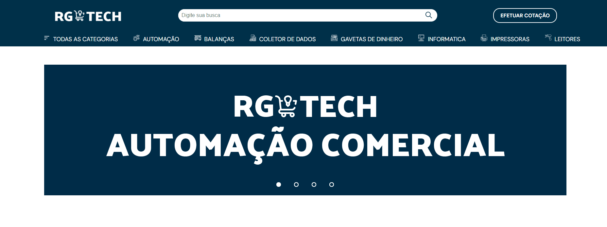

<h1 align="center"> RG TECH </h1>

Primeiro projeto feito tipo portfólio para uma empresa de automação comercial da minha cidade, o site consiste em mostrar os produtos disponíveis aos possíveis clientes da empresa.   

  <a href="#-tecnologias">Tecnologias</a>&nbsp;&nbsp;&nbsp;|&nbsp;&nbsp;&nbsp;
  <a href="#-projeto">Projeto</a>
  

  

 

Veja abaixo as imagens feitas no projeto.   

  
  
  
  
  
  

## 🚀 Tecnologias

Esse projeto foi desenvolvido com as seguintes tecnologias:

- PHP
- HTML
- CSS
- Git e Github
- Figma
- Database (MYSQL)

## 💻 Projeto

Esse projeto consiste em mostrar os produtos disponíveis na empresa para venda, nele usei PHP e MYSQL como banco de dados, onde eu faço o cadastro do produto (com descrição e tudo) totalmente por uma página a parte e já exibi diretamente no site sem um código muito grande ou várias páginas.

- [Acesse o projeto finalizado, online.](https://rgtechautomacao.com)

---

Feito com ♥ by Kauã Tiezzi [Entre em contato comigo clicando aqui.](https://www.linkedin.com/in/kauatiezzi/)

